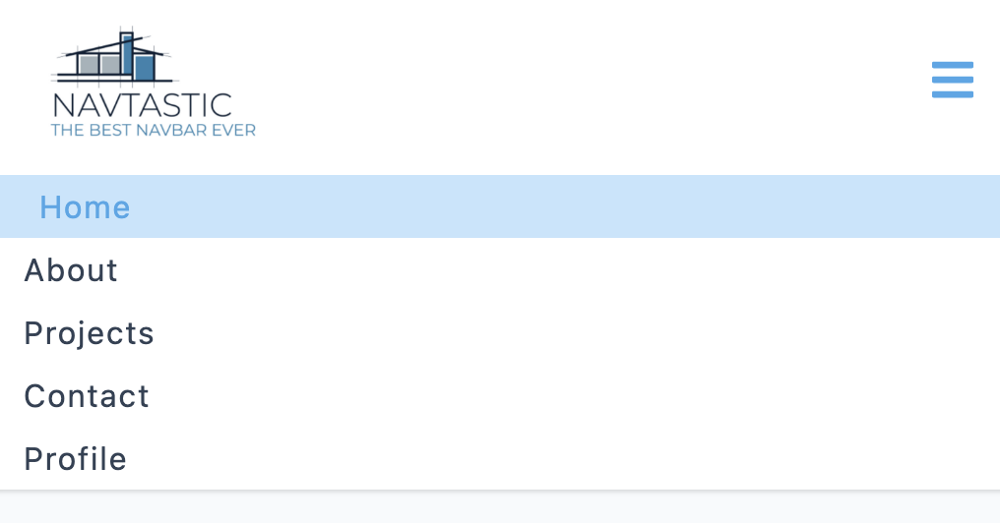

## NavPro App

This project is a fun and interactive Navbar component built using React. It provides an engaging user experience with dynamic navigation links and a toggle button to show or hide the links. The project follows a step-by-step approach, starting with setting up the Navbar component and importing data for links and social icons. It then progresses to implementing a `fixed` approach to hide and display the links using CSS classes. The final step introduces a `dynamic` approach using the `useRef` and `getBoundingClientRect()` functions to accurately calculate the height of the links. The project also includes a complete CSS styling for the Navbar, making it `responsive` and adding social icons for a visually appealing experience.

