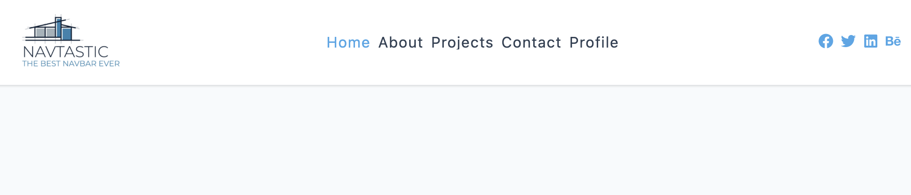
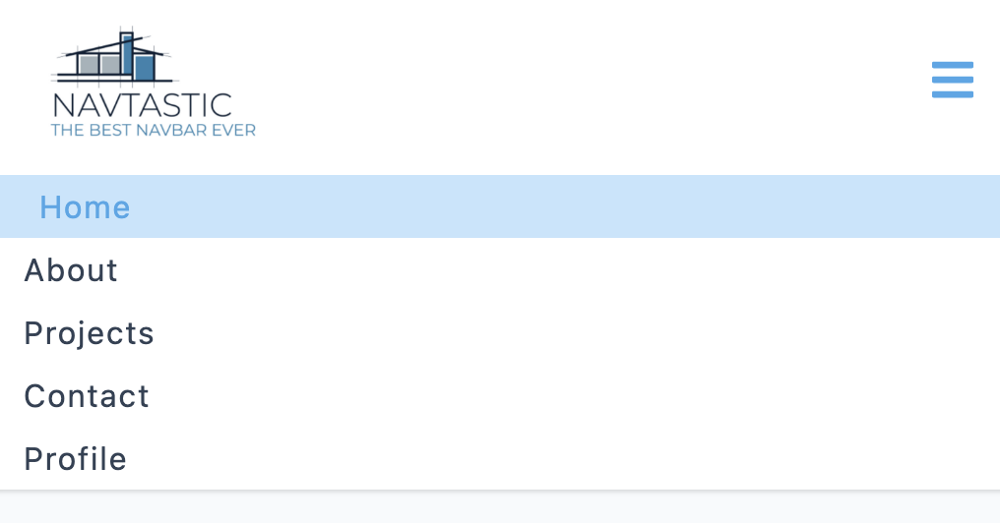

## Navtastic

This project is an interactive Navbar component built using React. It provides an engaging user experience with dynamic navigation links and a toggle button to show or hide the links. The project follows a step-by-step approach, starting with setting up the Navbar component and importing data for links and social icons. It then progresses to implementing a `fixed` approach to hide and display the links using CSS classes. The final step introduces a `dynamic` approach using the `useRef` and `getBoundingClientRect()` functions to accurately calculate the height of the links. The project also includes a complete CSS styling for the Navbar, making it `responsive` when updating the screen size.

### Tech Stack
- `JavaScript`: The foundational programming language for creating responsive and interactive features.
- `React`: The powerful JavaScript library used to build the project: 
- - `useState` The React hook used to manage state.
- - `useRef`: The React hook used to access and interact with DOM elements directly.
- `React Icons`: The popular library that provides a vast collection of icons for enhancing the user interface and user experience in the project.

### Explore The Website
[Navtastic on Netlify](https://navtastic.netlify.app/)

### Preview

